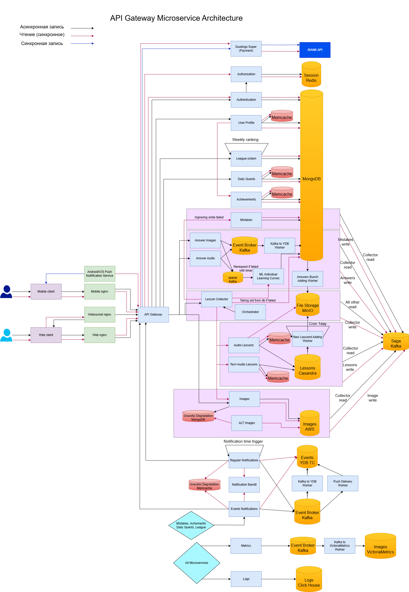

# Проектирование высоконагруженного сервиса на примере Duolingo

## Содержание

1. [Тема и целевая аудитория](#1-тема-и-целевая-аудитория)
2. [Расчет нагрузки](#2-расчет-нагрузки)
3. [Глобальная балансировка нагрузки](#3-глобальная-балансировка-нагрузки)
4. [Локальная балансировка нагрузки](#4-локальная-балансировка-нагрузки)
5. [Логическая схема БД](#5-логическая-схема-бд)
6. [Физическая схема БД](#6-физическая-схема-бд)
7. [Алгоритмы](#7-алгоритмы)
8. [Технологии](#8-технологии)
9. [Обеспечение надёжности](#9-обеспечение-надёжности)
10. [Схема проекта](#10-схема-проекта)
11. [Список серверов](#11-список-серверов)
12. [Список источников](#список-источников)

## 1. Тема и целевая аудитория

Duolingo - сервис для изучения иностранных языков.

Ключевой функционал сервиса - предоставление интерактивных уроков в виде уровней, наличие распознавания речи и рукописного ввода.\
Ключевые продуктовые решения - интенсивное напоминание клиенту о занятиях (уведомления), система лиг, друзей, соперничество, ежедневные и ежемесячные квесты. 
Все это помогает справится с самой большой проблемой образовательных проектов - нерегулярным посещением, малым прогрессом и большим процентом уходов клиентов из-за этого.

### **MVP**

1. Регистрация, авторизация
2. Локализация на множество языков (вариативность изучения большого числа языков на разных родных языках)
3. Прохождение курса иностранного языка\
  Уровни подстраивающиеся под клиента (может ли пользователь слушать или говорить, совершал ли он ошибки)
   * Аудирование - клиент слушает аудиозаписи с возможностью видеть текст и отвечает на вопросы по тексту.
   * Правописание - клиент рисует на экране символы алфавита изучаемого языка и после каждого движения нейросеть корректирует пользователя.
   * Изучение алфавита - тестирование на составление простейших слов, слогов, тренировка восприятия на слух алфавита изучаемого языка.
   * Постановка речи - клиент записывает свой голос читая или составляя фразу и нейронка проверяет корректность произношения выделяя неправильно произнесенные слова.
4. Система ежедневных и ежемесячных заданий и уведомлений
5. Система друзей и подписчиков - возможность комментирования и командного взаимодействия

### Фичи

1. Система лиг - соревнования с группой людей по количеству набранных за неделю очков, получаемых за прохождение уроков
2. Система достижений
3. Распознавание речи в уроках для тренировки произношения
4. Распознование рукописного ввода для уроков изучения алфавитов

### **Целевая аудитория**

Посещений за месяц: 97.6M 28% или 32.4M из США\
Посещений в день 31.4M\
Неэффективных пользователей : 32.38%\
Среднее количество посещенных страниц за сеанс: 6.13\
Средняя продолжительность посещения: 00:08:51

Из вышеперечисленного следует, что целевая аудитория Duolingo люди в возрасте от 18-54, хотя я думаю что и младше тоже надо учитывать, потому что есть программы внедрения в школы.
 Продукт подходит и актуален для любых стран хотя больше всего используется в северной Америке.

## 2. Расчет нагрузки

### **Продуктовые метрики**

* Посещений за месяц: 97.6M
* Посещений в день 31.4M

Duolingo хранит большой объем данных, но они универсальны для всех пользователей - множество языков, слов, иероглифов, изображений алфавитных символов для их распознавания,
 аудиозаписи очень большого количества фраз и тд. Уникальными для каждого пользователя являются такие данные как: регистрационные данные пользователя, данные профиля,
  собираемый из примитивов аватары пользователей (что позволяет не хранить картинки, а собирать их по идентификаторам (или хранить в кеше недолгое время пока пользователь активен)),
   данные о достижениях пользователя, о подписках, подписчиках, состояние прохождения пользователем квестов и тд. однако это текстовая или числовая информация очень малого объема,
    которая учитываться не будет. Также приложение хранит аудиозаписи голоса пользователя и изображения его рукописного ввода, это медиаконтент занимающий значительных объем памяти. \
В среднем пользователь проводит на сайте 9мин, на сайте сказано что на прохождение одного урока требуется около 7мин. В одном уроке примерно 3 задания на произношение,
 которые в среднем требуют 20-30сек аудиозаписи, также учтем, что пользователи ошибаются и возьмем что в среднем на 1 задание требуется 2 попытки. Получаем 1 урок -> 3 задания на аудирование -> 6 попыток -> 3мин аудиозаписи в день на пользователя.
  Так как пользователь обучается языку и не привык на нем говорить, для распознавания его речи понадобится высокое качество аудиозаписи - возьмем 320kbps, для 3мин это будет 7,03 MB. \
Также оставшиеся 2 минуты из 9 минут посещения считаем изучением правописания алфавитных символов, это примерно 0.5 урока на изучение правописания,
 в 1 уроке примерно 8 заданий на написание, изображение может быть не очень высокого качества так как изображается только 1 символ, однако слишком маленьким быть не может так как есть сложные иероглифы,
  на сайте при разных размерах экрана изображение варировалось от 300х300 до 400х400.

Для перестраховки возьмем 400 на 400 пикселей, изображение ЧБ соответственно 160000 пикселей будет весить 320000бит это 40Kb каждое,
однако корректировка пользователя происходит после каждой линии соответственно с учетом иероглифов состоящих из множества линий возьмем среднее значение в 6 линий на символ,
 значит 6 картинок на одно задание это уже 240Kb. 0.5 урока -> 4 задания на рисование -> 960Kb на пользователя в день.
Duolingo не хранит неправильные попытки наверняка и отсеивает 40% (предположение) данных, а из остального получаем прирос в месяц.
Согласно найденным данным Duolingo был запущен 2012, в 2017 было уже 30MAU, в 2021 40MAU, в 2023 83MAU, в 2024 113MAU, построим примерный график.

Будем считать что DAU=0.25MAU так как сейчас почти треть, но раньше было меньше наверняка. Посчитаем площадь под кривой - 497M, разделим на 12 лет получим 41,41M MAU среднюю. 10,3M DAU среднее из расчета четверть MAU.
Далее у нас есть 500М пользователей в приложения на андроид что составляет 80% от всех мобильных пользователей значит всего их 625M, что в свою очередь 80% всех пользователей, значит всего 781M,
 разделим объем на данный момент на количество пользователей на данный момент и получим средний размер хранилища в штуках и GB.

| Тип данных                    | Средний размер | Единиц на пользователя в день | Количество на данный момент | Вес на данный момент | Прирост в день|Прирост в месяц|Средний размер хранилища пользователя (Шт)|Средний размер хранилища пользователя (GB)|
| -----------------------       | -------------- | ---------------------- | --------------------------- | -------------------- | --------------- | --------------- |--------------- | --------------- |
| Аудиозапись голоса            | 1,16MB(1мин)   |  3   |   1,35*10^11  |    150000TB |  +104TB   |+1870TB   | 172,86   | 0,2   |
| Изображения рукописного ввода | 40Kb           |   24 | 1,08*10^12    |  40000TB   |    +28TB |+504TB   | 1382,84   | 0,05   |
| Суммарно | -           |   - | 1,21*10^12    |  190000TB   |    +132TB |+2374TB   |  1555,7 |  0,25 |

> **Примечание:**
>
> * Прирост в день на основе актуальных данных, общее количество на основе усредненных.
> * Количество данных из расчета, что все данные всех пользователей хранятся как минимум для улучшения используемых в приложении нейросетей.

| Действие пользователя              | Среднее количество в день у 1 пользователя |
| ---------------------------------- | ------------------------- |
| Задание на произношение                       |    3 |
| Задание на правописание                       |   4  |
| Задание с озвучкой                       |  19   |
| Задание аудирование                       |  0.3   |

> **Примечание:**
>
> * Задание на произношение - пользователь отправляет на сервер аудиозапись примерно 1,16MB.
> * Задание на правописание - пользователь отправляет на сервер в среднем 6 картинок которые суммарно весят примерно 240Kb.
> * Задание с озвучкой - пользователь получает с сервера 2 аудиозаписи примерно 1,4MB в обычном темпе и с более четким и медленным произношением (записи 2, но они меньше чем пользовательские).
> * Задание аудирование - пользователь получает с сервера примерно 6 аудиозаписей примерно 5,2MB суммарно.

### **Технические метрики**

График посещения выглядит примерно так, добавим к этому малое размытие аудитории по часовым поясам и активное напоминание пользователям в определнные часы - соответственно пиковое потребление от среднего отличается в 4 раза.

DAU = 31M, каждый пользователь в течении 9 мин выполняет 0.7 уровня и 0.3 аудирования (выполняет либо либо, но аудирование реже встречается)  и 0.5 задания на правописания.
Получается общее количество запросов на задания: с произношением - 93M, с правописанием - 124M, с озвучкой - 589M, аудирование - 9,3M.
Из этих данных рассчитаем Средний RPS, равномерно распределив запросы в течении дня, а потом посчитаем пиковый RPS из предположения что распределение согласно картинке выше и Максимальный RPS=4*RPS средний.
Для того чтобы посчитать пиковое потребление в секунду домножим пиковый RPS на вес тела запроса и переведем в Гбит/с. Далее конвертируем его в суточный и переводим в Гбайт/сутки.
При регистрации указываются только почта и пароль которые практически ничего не весят и ими можно пренебречь даже при большом RPS.
Предположим повторную авторизацию раз в месяц и из этого её рассчитаем. На главную страницу пользователь попадает каждый раз когда заходит на сайт так, что он будет больше DAU (1.5 раза так как ещё при переключении между курсами и после лидерборда).
Регистрацию рассчитаем из предположения о приросте как за последний год (+22М/360дней/24часа/60сек).

| Действие пользователя              | Средний RPS | Пиковый RPS |Пиковое потребление в сутки Гбит/с|Суммарный суточный Гбайт/сутки|
| ---------------------------------- | ------------|------------ |------------ |------------ |
| Регистрация                       |    42 |    167 |    0 |    0 |
| Авторизация                       |    37 |    149 |    0 |    0 |
| Главная страница                       |    363 |    1453 |    0 |    0 |
| Задание на произношение                       |    1076 |    4304 |    39 |    421254 |
| Задание на правописание                       |   1435  |    5740 |    2,62 |    28377 |
| Задание с озвучкой                       |  6817   |    27268 |    74,6 |    805258 |
| Задание аудирование                       |  107   |    428 |    4,3 |    46946 |
| Суммарно                       |  -   |   -  |    120,52 |   1301838  |

## 3. Глобальная балансировка нагрузки

### Функциональное разбиение по доменам

Отсутствует - вся функциональность сайта находится по одному домену www.duolingo.com

### Обоснования расположения ДЦ (влияние на продуктовые метрики)

Требуется расположить ДЦ во всех регионах самого активного пользования так как это позволит уменьшить задержку, которая влияет на продуктовые метрики и user experience.
Во время прохождения уроков предзаписанное аудио можно выгружать заранее и параллельно прохождению урока, но вот пользовательские записи голоса придется отправлять и обрабатывать в онлайн формате,
так как пользователь не захочет долго ждать их обработки, перед тем как перейти к следующему заданию или исправлению этого. Для оптимального расположения еще раз посмотрим на карту распространения пользователей.
Сервер средней мощности (8 vCPU, 32GB RAM) может выдавать примерно 100-500 Мбит/с возьмем в среднем 300 Мбит/с. Пиковое потребление в сутки  в прошлом разделе вышло 120,52 Гбит/с.
Значит нам понадобится 120,52*1024/300=412 таких серверов, возьмем запас х2 для надежности это получится 800 серверов. Расположим их по 6 ДЦ, но не равномерно а в соответствии с количеством пользователей.

* 2 ДЦ в США (в Альбукерке и Индианаполисе) он будет покрывать 28.3% трафика приходящего США,
соответственно на него будет приходиться 28.3% серверов, 227 серверов по 113 серверов на каждый ДЦ в США.
* ДЦ в Канаде (в Эдмонтоне ближе к США да и плотность населения в Канаде ближе к северной границе США выше) он будет покрывать 3.6% трафика приходящего из Канады и поддерживать сервера США в случае их перегруженности,
соответственно на него будет приходиться 3.6% серверов = 29 серверов.
* ДЦ в Бразилии (в столице там будет легче обеспечить необходимые для строительства ДЦ условия) он будет покрывать 6.5% трафика приходящего из Бразилии и поддерживать сервера США в случае их перегруженности,
соответственно на него будет приходиться 6.5% серверов = 52 сервера.
* ДЦ в Великобритании (в Ньюкасле) он будет покрывать половину оставшихся 52.5% трафика приходящего из остальной мир и 5% из самой Великобритании,
соответственно на него будет приходиться 29,05% серверов = 233 сервера.
* ДЦ в Германии (в Дрездене) он будет покрывать половину оставшихся 52.5 % трафика приходящего из остальной мир и 3.9% из самой Германии,
соответственно на него будет приходиться 30,15% серверов = 242 сервера.

### Расчет распределение запросов из секции "Расчет нагрузки" по типам запросов по дата центрам

Запросы на регистрацию, авторизацию и получение главной страницы не несут много данных и не обязательно должны быть мгновенными, поэтому их можно посылать в любой ДЦ, поэтому будем выбрать наименее загруженный. Аудирование и задания с озвучкой несут много аудиоданных, однако могут загружаться пока пользователь выполняет предыдущее задание, так как порядок заданий строгий, поэтому задержка здесь тоже не важна и мы будем присылать из на наименее загруженный сервер.
А вот в заданиях на произношение и правописание необходимо как можно быстрее вернуть пользователю результат анализа его данных, поэтому следует отправлять эти запросы в ДЦ с минимальной задержкой ответа.

| Действие пользователя              | Распределение по ДЦ |
| ---------------------------------- | ------------|
| Регистрация                       |    Наименее загруженный |
| Авторизация                       |    Наименее загруженный |
| Главная страница                       |    Наименее загруженный |
| Задание на произношение                       | С минимальной задержкой |
| Задание на правописание                       | С минимальной задержкой |
| Задание с озвучкой                       |  Наименее загруженный   |
| Задание аудирование                       |  Наименее загруженный   |

### Схема DNS балансировки

DNS балансировка будет производиться между континентами, так как IP адреса довольно хорошо локализованы меду ними. Выберем тип Latency-based DNS балансировки для этого, так как Round-Robin подход нас не устраивает из-за того, что задержка будет приличная, так как сервера на разных полушариях. Geo-based тоже в принципе подходит, но не учитывает загруженность серверов и еще не все согласны добавлять свой пусть и анонимизированный IP в запрос для определения геолокации. Latency-based DNS выдает адрес ближайшего к пользователю ДЦ c с минимальным RTT (круговой задержкой).

### Схема Anycast балансировки

Внутри стран DNS балансировка работает хуже роутинга из-за того что крупные компании могут не заморачиваться о задержке между городами поставив общие dns сервера в годах, так как из сеть слишком глобальная, поэтому будем использовать BGP Anycast. Балансировка будет только в Северной Америке и в Европе, так как нужна сложная настройка, автономный номер AS (Необходимо договориться с двумя вышестоящими провайдерами, и получить от них номер автономной системы) и доступ к BGP (протокол динамической маршрутизации). BGP Anycast балансировка позволит минимизировать задержку для пользователей в Северной Америке и уменьшить количество неоптимальных запросов в Европе. Необходимо выбрать разные веса для ДЦ, чтобы запросы от одного пользователя не расщеплялись - решение хеширование одно и тоже TCP IP соединение попадает в один и тот же ДЦ.

### Механизм регулировки трафика между ДЦ

Регулировка трафика также будет происходить в Северной Америке и в Европе, на карте обозначены зоны ответственности серверов, в местах их пересечения пользователи могут быть отнесены как одному серверу так и к другому в зависимости от загруженности.

## 4. Локальная балансировка нагрузки

Будем использовать программную балансировку каскадно - сначала L4, потом L7.
Для начала развернем кластер Kubernetes в каждом нашем ДЦ это позволит нам использовать оркестрацию.
Система оркестрации при создании контейнера вносит экземпляр в реестр после успешного прохождение readiness пробы:  
Readiness check - Иногда приложения временно не могут обслуживать трафик. Например, приложению может потребоваться загрузить большие данные или файлы конфигурации во время запуска или зависеть от внешних служб после запуска. В таких случаях вы не хотите завершать работу приложения, но и не хотите отправлять ему запросы. Kubernetes предоставляет проверки готовности для обнаружения и смягчения таких ситуаций.  
Liveness check - Проверка работоспособности серверов с помощью специального cgi-bin/ping (максимально похожий на обычный запросы, но не создающий нагрузки). Ping не позволяет проверить запущен ли нужный софт на машине.
Установка соединения на порт, проверяет, что сревис слушает порт, но не проверяет его способность отвечать.
Простенький head или get запрос тоже не подойдет, так как не проверит работоспособность взаимодейтсвия сервиса с бд например. Поэтому будем использовать cgi-bin/ping который позволит все это проверить.
Также использование Kubernetes позволит нам сделать масштабирование через auto-scaling - при этом в пиковые часы развертывается больше мощностей и снижать их когда нагрузка спадает.
С DNS балансировкой внутри ДЦ возникает много проблем с кешированием и появляется высокая нагрузка на сам DNS.

### IP балансировка L4: Virtual Server via IP Tunneling

NAT нам не подходит, так как сам балансировщик станет узким местом из-за того что весь обратный трафик идет через балансировщик.  
В случае Direct Routing сервера должны быть в одной физической сети, да и это не является стандартом индустрии и над ним не ведется активной разработки и залатывания уязвимостей.  
IP Tunneling позволит нам располагать сервера в разных физических сетях и обеспечит высокую производительность, хоть и потребует сложной настройки.  
**Суть метода**:
Балансировщик инкапсулирует запрос в IP-туннель и отправляет его реальному серверу. Реальный сервер извлекает оригинальный пакет и отвечает клиенту напрямую.
Для надежности балансировки используем технологию VRRP/CARP с ней балансеров нужно в 2 раза больше, чем для обеспечения пикового трафика.  
**Суть** - один IP поднят на 2 машинах, но на одной он не анонсируется в сеть, когда один падает второй получает весь трафик анонсируя в сеть что IP теперь принадлежит этому MAC-адрес.

### Layer 7 HTTP Reverse Proxy

Предварительный парсинг оригинального протокола (хоть мы и читаем протокол дважды, за счет высокой производительности С на котором написаны обработчики балансировщиков и меньшей производительности приложений,
написанных на Python и Go это не даст большого прироста времени обработки)
HTTP Reverse Proxy позволит:

* Производить SSL Termination на прокси сервере перед передачей на бекенд
* Кешировать ответы бекенда
* Gzip - сжимать данные перед отправкой
* решит проблему медленных запросов, так как nginx позволяет перехватывать ответы от бекенда и освобождать воркеров, занимаясь передачей данных медленному клиенту самостоятельно.
Также следует сделать авторизацию на nginx - сделать отдельный сервис авторизации и не пускать никакие запросы от неавторизованных пользователей, это даст дополнительную защиту от DDOS атак и позволить проводить авторизацию с существенно большим RPS.
Еще L7 балансировка позволит перенаправлять запросы с упавших серверов на живые (прям те которые обрабатывались в момент падения), тем самым создавая максимально хороший user experience - для пользователя вообще незаметно падение серверов.  
Nginx держит постоянное соединение с бекендом, что сильно экономит ресурсы на запросы установления соединений.  
В качестве алгоритма балансировки выберем list-connections, где мы кидаем запрос на тот сервер у которого меньше всего соединений, так как у нас запросы долгие и тяжелые (обработка медиаконтента клиента), это подойдет лучше чем round-robin.
В качестве таймаута используем метод определения с помощью квантилей, выберем - p90 оптимальный баланс стабильности и скорости.

**Для терминации SSL** выберем алгоритм ECDSA 256-бит, он быстрее (40–60% по сравнению с RSA), создает меньше нагрузка на CPU.
Для оптимального трафика необходимо держать максимальное количество пользовательских сессий в кеше, потому что установка нового handshake очень дорогая и по latency и по CPU.
Есть вариант оптимизировать SSL терминацию путем выдачи всем хостам внутри ДЦ одного и того же IP, и использовать тогда все зависимости от того куда балансировщик распределит запрос пользователя, сессия всегда убдет валидна и не придется заново устанавливать handshake из-за того, что поменялся IP у принимающего запрос хоста.

## 5. Логическая схема БД

### **Таблицы:**

**Пользователь** - содержит информацию о пользователе, может быть разделена на группы пользователей, путем хеширования id пользователей по физически разным БД, что снизит нагрузку.  
**Таблица авторизации** - содержит авторизационные данные пользователя, выделены в отдельную таблицу, так как они запрашиваются только сервисом авторизации и могут быть изолированы.  
**Подписки** - содержит данные о том какой пользователь на какого пользователя подписан.  
**Прогресс курса** - тоже подлежит большой нагрузке, поэтому можно также разделить на части по группам пользователей.  
**Лиги** - содержит информацию о лигах и людях которые в них состоят, так как внутри лиг существуют группы, обновляемые раз в неделю, каждая строка будет представлять группу, список пользователей использовать нормально, так как обновляется он целиком раз в неделю.  
**Достижения** - содержит информацию о достижениях пользователя, нагрузка равна нагрузке на пользователей, но вынесена так как обновляется по частям каждое достижение в отдельности.  
**Ежедневные задания** - информация о состоянии ежедневных заданий пользователей также часто обновляется, поэтому вынесена в отдельную таблицу.  
**Содержание курса** - таблица для объединения заданий в курсы, и для комбинирования курсов на несколько языков.  
**Тестовые задания** - задания содержащие только текст, разделены для оптимизации памяти и нагрузки.  
**Аудиозаписи пользователя** - аудиозаписи, которые присылал пользователь в качестве ответов на задания, также высокая нагрузка на запись поэтому вынесена в отдельную таблицу.  
**Графические файлы пользователя** - графические файлы, которые присылал пользователь в качестве ответов на задания, также высокая нагрузка на запись поэтому вынесена в отдельную таблицу.  
**Аудиозадания** - задания содержащие только аудио, разделены для оптимизации памяти и нагрузки.  
**Текстовые задания** - задания содержащие только текст, разделены для оптимизации памяти и нагрузки.  
**Список уведомлений** - список уведомлений пользователя, также часто обновляются поэтому выделено в отдельную таблицу.
**Ошибки пользователя** - содержит последние ошибки пользователя, также часто обновляются поэтому выделено в отдельную таблицу.  
**Многократно используемые изображения** - так как изображения в большинстве своем часто повторяются и состоят из одних элементов, выделена отдельная таблица для хранениях этих примитивов из которых собираются все изображения.  
**Очередь уведомлений** - очередь уведомлений для реализации realtime уведомлений.  
**Графические метрики** - сбор метрик в виде графиков для мониторинга состояния сервиса.  
**Логи** - логирование запросов выделено в отдельную таблицу, так как ее можно отдельно оптимизировать.  
**Клиентское логирование** - логирование событий в которое происходит запись блоками из брокера событий.  
**Таблица сессионных токенов** - таблица хранящая сессии пользователей, для нее отдельно удобно использовать redis.  
**Брокер событий** - регистрирует все события собирает их в блоки и записывает в таблицу клиентское логирование.  

### **Логическая схема:**

В таблицах слева направо столбцы называются соответственно  
Тип поля, название поля, RPS на чтение, RPS на запись

### **Особенности распределения нагрузки по ключам:**

* **Шардирование по пользователям**

Пользователей очень большое количество (500М+) и у них мало взаимодействия друг с другом, поэтому их можно шардировать по id Пользователя, разделив пользователей на группы и закрепив их id за определенным шардом, например с помощью hash-map структуры, таблицы содержащие id Пользователя также будут хранится в тех же шардах и распределяться по ним по такому же механизму - для простого и быстрого доступа.

* **Партиционирование по дате**

Для Логирования часто используют отдельную БД, а также партиционирование по  по месяцам/неделям. Устаревшие логи можно перемещать в более дешевое хранилище, так как их анализируют реже и нагрузка на них меньше.

* **Репликация**

Для повышения отказоустойчивости (альтернативных источников чтения в случае проблем с БД) и повышения скорости чтения + разделения нагрузки на чтение и запись используют реплики. Основной узел Primary отвечает за запись, а чтение масштабируется за счёт Replica-нод (Secondary).

## 6. Физическая схема БД

### Выбор баз данных

**MongoDB** - будем использовать для большинства таблиц, автоматически хорошо масштабируется, Casandra не нужна так как там требуется полная денормализация.  
**YDB Topic Service** - для realtime уведомлений, надежная модель горизонтально масштабирования, в одну шину пишем из другой читаем, лучше чем Kafka переживает шардинг, хранение данных не в трехкратном размере а в 1,5 с той же степенью надежности.  
**Click House** - для логов и метрик в цифровом виде, он позволит хорошо сжимать данные и обрабатывать большие нагрузки.  
**Virtoria metrics** - для графиков метрик - более горизонтально масштабируемая система.  
**MinIO** - будем использовать для хранения пользовательских аудиозаписей и рукописных вводов, так как эта БД имеет высокую нагрузку на запись, хорошо масштабируется, поддерживает S3.  
**Cassandra + S3** -  будем использовать для хранения аудиофайлов, которые будем раздавать клиентам, Cassandra имеет низкие задержки на чтение, хорошо масштабируется и дешевле AWS.  
Blob для мелких изображений, выберем **AWS S3**, что обеспечит нам качественные алгоритмы и высокую поддержку, хорошее горизонтальное масштабирование при необходимости.  
**Kafka** - будет использоваться как брокер событий.

### Шардирование

Будем использовать **Primary-Secondary** шардирование, это позволит нам снизить высокую нагрузку на чтение, разделив ее по Secondary репликам.
Будем использовать **Hash-based sharding** на основе ключей - чаще всего **id пользователей**, так как они равномерно распределены по всему диапазону, а также таблицы соответственно хорошо изолированны из-за малого взаимодействия пользователей друг с другом.  
В **mongodb** один mongod может обрабатывать 10K операций в секунду, исходя из этих расчетов и того, что mongodb не умеет выполнять join между шардами, получим 7 шардов.  
В логгировании (таблицы с логами и метриками) будем использовать **партиционирование по дате**.  
В базе данных **VirtoriaMetrics** - vminsert распределяет данные по шардам по хэшу метрики, поэтому:  
Все данные с одинаковыми именем метрики попадают на один шард. Это уменьшает нагрузку на один узел, но важно правильно подобрать количество шардов. (Будем использовать 5 шардов это оптимальное количество для примерно 10-50 млн временных рядов)  
**MinIO** - это объектное хранилище, совместимое с S3 API, которое поддерживает горизонтальное масштабирование за счёт дисков и серверов. Шардирование в MinIO происходит на уровне разбиения данных (erasure coding) и балансировки между узлами (distributed mode).  
Erasure Coding (EC) - ключевая технология MinIO разбивает объекты на фрагменты и распределяет их по дискам. Выберем для отказоустойчивости конфигурацию EC:4+2: 4 фрагмента для данных 2 фрагмента для восстановления. 
В **Casandra** для крупных кластеров используется более 30 узлов, так как у основная нагрузка у нас идет здесь то выберем 35 узлов и соответсвенно 512 vnodes (в Apache Cassandra, который позволяет одному физическому узлу (серверу) отвечать за несколько диапазонов токенов в кластере, а не за один непрерывный диапазон, как в традиционном подходе с ручным распределением токенов). Это позволит проводить автоматическую балансировку, упростить администрирование и улучшить распределение.

### Резервирование

Будем использовать **автоматическое резервирование**, если Primary выходит из строя, один из Secondary становится новым Primary.  
Также будем использовать mongodump / mongorestore, для логического бекапа всей БД в BSON-формате и восстановления данных соответственно.  
Для быстрого восстановления будем использовать mongodump, который делает снапшот всей БД.
Также будем использовать облачные бекапы в S3 через MongoDB Atlas.  

### Мультиплексирование запросов

MongoDB-клиенты используют пулы соединений для повторного использования уже установленных подключений. Это уменьшает накладные расходы на создание новых соединений.  

* При новом запросе клиент не создаёт новое соединение, а использует готовое из пула
* Если соединений не хватает, пул создаёт новые
* Если соединение не используется долгое время, оно может быть закрыто

Также будем использовать Keep-Alive соединения (долгоживущие TCP-соединения) для поддержания обмена файлами с клиентом, для меньшей задержки и более полезной утилизации ресурсов сервера (не будем тратить ресурсы на установление новых соединений).

### Индексы

Обозначены белыми треугольниками на физической схеме БД.

| Название поля              | Тип индекса |
| ---------------------------------- | ------------|
| Никнейм пользователя                      |    Text Index |
| id Пользователя                       |    Hashed Index |
| id Лиги                       |    Hashed Index |
| Почта                       | Text Index |
| id Подписчика                       | Hashed Index |
| date (Логи)                       |  Partitioning   |
| date (Графические метрики)                       |  Partitioning   |
| id лога                       | Hashed Index |
| id метрики                       | Hashed Index |
| тип задания                       | Hashed Index |

### **Физическая схема:**

Синие треугольники - ключи шардирования
Белые треугольники - индексы

## 7. Алгоритмы

### Алгоритм выявления мошенничества (поиск сборщиков заданий)

#### Актуальность

**Сборщики заданий** - запоминают, записывают и делятся тестовыми заданиями. Это может поставить под угрозу достоверность
и справедливость тестов на аттестацию и нанести финансовые и репутационные потери компаниям, проводящим тестирование. Однако такое поведение, как сбор заданий, **не проявляется с помощью обычных систем поиска мошенников**, так как поведение сборщиков
слишком слабо отличается от поведения обычных пользователей. Требуется более ориентированный на данные подхода для обнаружения. С этой целью используется
двухэтапный исследовательский подход, основанный на **алгоритме неконтролируемого обучения**, кластеризации k-средних (MacQueen, 1967).

#### Область применения

Анализ данных для обнаружения аномального поведения при тестировании. Используется при проведении крупных серьезных тестов на квалификацию и выявления недобросовестных испытуемых.

#### Алгоритм

В частности, используется метод кластеризации для изучения архетипов процесса сдачи теста и дальнейшее выявление испытуемых, чьи поведенческие модели отклоняются от архетипа.  
  
Методы статистического моделирования предназначены для обнаружения аномальных процессов реагирования с четким
операционным определением (например, процессов реагирования с большим количеством изменений правильных и
неправильных ответов), в то время как предлагаемый метод предназначен для обнаружения аномальных процессов
реагирования, которые трудно определить операционно. С другой стороны, типы данных, используемых этими методами,
различны. Методы статистического моделирования использовали только ограниченное разнообразие данных процесса,
если таковые имелись, в то время как предлагаемый метод использовал широкий спектр данных процесса. Например,
метод моделирования Ван дер Линдена и Го предназначен для применения исключительно ко времени реагирования,
в то время как предлагаемый метод в этом исследовании использует информацию об изменении ответа и повторном
посещении элемента в дополнение к времени реагирования.  
В кластеризации k-средних, точки данных, принадлежащие **одному кластеру**, считаются имеющими больше
сходства, чем другие точки в других кластерах. Центр каждого кластера называется центроидом.  
Поскольку количество кластеров K должно быть заранее указано в алгоритме кластеризации k-средних и
может повлиять на результаты кластеризации, крайне важно выбрать разумное количество кластеров.
Для определения **количества кластеров** было предложено несколько статистических методов.
Например, в «elbow method» **запускаются несколько раундов кластеризации** k-средних с
различным количеством K, и процент объясненной дисперсии наносится на график в
зависимости от количества кластеров и выбирается самый оптимальный.  

В целом, алгоритм позволяет ответить на три исследовательских вопроса:

1) Сколько существует архетипов процесса сдачи теста?
2) Каковы характеристики каждого архетипа?
3) Какие испытуемые демонстрируют процессы сдачи теста, отклоняющиеся от большинства?  

  
Представленные на рисунке 1 разными цветами точек указывают на категорию первоначального ответа или изменения ответа. В
этом исследовании переменная типа действия имеет шесть возможных значений, включая «От пустого к правильному» (BTR), «От
пустого к неправильному» (BTW), «Без изменений» (NC), «От правильного к неправильному» (RTW), «От неправильного к правильному»
(WTR) и «От неправильного к неправильному» (WTW). Видно, что этот испытуемый отвечает на большинство пунктов последовательно.
Посмотрев все пункты хотя бы один раз (обозначены вертикальной красной линией), испытуемый последовательно пересматривает
первые 50 пунктов и вносит несколько изменений в ответы.  
Проводятся **два раунда кластеризации по методу k-средних**: первый раунд реализуется на уровне сегмента действия, что позволяет
изучить поведенческие архетипы; а второй раунд реализуется на уровне личности, что позволяет изучить архетипы испытуемых.  
  
Каждый сегмент действий описывается рядом характеристик, таких как **среднее и стандартное отклонение времени ответа, количество изменений ответа** и т. д.
Сегменты действий всех испытуемых анализируются совместно с использованием кластеризации k-средних.
Полученное количество кластеров указывает на количество поведенческих архетипов, в то время как характеристики
каждого архетипа описываются характеристиками соответствующего центроида кластера.  
Алгоритм обнаружения выбросов на основе k-средних **определяет точки данных, которые находятся далеко от кластеров**. Выбросы помечаются как на уровне сегмента
действия, так и на уровне человека, таким образом, обнаруживаются как выпадающие поведения при прохождении теста, так и испытуемые.  

Вот пример сначала - формируются кодовые слова и их основные характеристики, затем из частоты кодовых слов формируются архетипы.
  
Визуализация последовательности действий испытуемого, у которого 15 сегментов действий были идентифицированы как выбросы.  

### Алгоритм для оптимизации выбора уведомления

#### Актуальность

Многие мобильные приложения полагаются на ежедневные электронные письма и push-уведомления для увеличения и поддержания вовлеченности пользователей.
Проблематика -

1) «Свежие» шаблоны уведомлений имеют тенденцию оказывать большее влияние на поведение пользователя, однако их тяжело корректно генерировать и определять как часто нужно менять текст уведомлений.
2) Каждый шаблон имеет определенные критерии приемлемости, чтобы предотвратить отправку шаблона неподходящему пользователю.

Введение это алгоритма привело к **увеличению общего числа активных пользователей в день (DAU) на 0,5%**
и **увеличению удержания новых пользователей на 2%** по сравнению с сильным базовым уровнем.

#### Область применения

Уведомления используются в мобильном приложении и в его веб версии.

#### Алгоритм

**Цель напоминаний** о практике Duolingo - побудить пользователей завершить хотя бы один урок изучения языка в день, поэтому наша награда должна это отражать.
Чтобы минимизировать объем органической активности, учитываемой в нашей функции вознаграждения, мы **учитываем только уроки, завершенные в течение двух часов** с момента уведомления.
Таким образом, мы определяем функцию вознаграждения, следующим образом: вознаграждение равно 1, если пользователь завершает урок в течение двух часов с момента отправки напоминания, и 0 в противном случае.
**Для каждой руки собирается набор предыдущих раундов**, в которых эта рука была приемлемой. Эти **наборы исторических раундов используются для оценки эффективности каждой руки** и
построения политики использования. Эта изученная политика применяется в будущих раундах для выбора руки, пока политика не будет обновлена снова.

**Не все оружие доступно в каждом раунде.** Например, если рука A доступна только для очень активных пользователей, а рука G доступна для всех пользователей, то исторические раунды, где была выбрана
рука A, вероятно, будут иметь гораздо более высокое вознаграждение **независимо от эффективности руки**. Рука А имеет гораздо более высокое среднее вознаграждение.
Однако во втором столбце мы видим, что эта разница в основном объясняется тем, что руки подходили для различных (но, возможно, перекрывающихся) наборов раундов.
Кроме того, **часто вводятся оружия с новыми правилами приемлемости**. Таким образом, в качестве ограничения дизайна мы не хотим, чтобы алгоритм бандита напрямую зависел от правил приемлемости. В противном случае реализация
алгоритма бандита должна была бы модифицироваться каждый раз, когда новый набор правил приемлемости был бы введен в производство, что значительно **увеличило бы стоимость обслуживания алгоритм**.
Также у упрощенной системы есть **несколько недостатков**

1) В случае низкой изначальной оценки - рука может никогда не восстановиться, поскольку оценка может быть настолько низкой, что рука всегда будет худшим выбором и никогда не обновит свою оценку
2) А случае очень высоких изначальных оценок - оценка может перевесить штраф за новизну  настолько, что рука будет использоваться повторно для всех приемлемых раундов, пока оценка руки не сойдется к более точной оценке.

Для регуляризации этих оценок используется эмпирическая Байесовскую оценка.
Также используется когнитивно-мотивированная формула. Когда рука ранее была выбрана для данного пользователя, мы применяем **штраф за новизну** к ее оценке, чтобы смоделировать
**отсутствие эффекта новизны**. Однако мы предполагаем, что этот **штраф должен ослабевать** по мере того, как память пользователя о предыдущем уведомлении исчезает.
Было показано, что экспоненциальные функции спада хорошо моделируют человеческую память.

На рисунке ниже показано, как алгоритм бандита был **интегрирован в систему уведомлений Duolingo**. Каждый раз при отправке уведомления необходимо фиксировать выбранную руку и другую информацию, чтобы можно было рассчитать вознаграждение.
Кроме того, вспомогательная база данных, указанная на схеме как история пользовательских рук, используется для отслеживания последнего времени каждой руки.

### Алгоритм оценки уровня владения языком на основе машинного обучения

#### Актуальность

Автоматизированный алгоритм оценки уровня владения языком и определения уровня сложности заданий крайне необходимая и выгодная вещь и одна из ключевых фич Duolingo. Правильное и быстрое определение уровня владения языком нового пользователя позволяет
сразу захватить его внимание интересующими его заданиями - не слишком сложными и не слишком легкими - а значит напрямую **увеличить конверсию новых пользователей**. Также грамотное отслеживание уровня роста владения языком во время обучения позволяет
лучше захватывать внимание пользователя - не забрасывая его новыми словами или наоборот не топчась на месте - что **увеличивает процент постоянных пользователей** и поднимает среднее время пользования платформой в день.

#### Область применения

Алгоритм используется во всем приложении и является его **killer фичей**, а также для проведения серьезных тестирований на квалификацию, что позволяет сэкономить человеческие ресурсы.

#### Алгоритм

Алгоритм разделяет абстрактное понятие владения языком на пять форматов по языковому тестированию. Они **оценивают чтение, письмо, аудирование и навыки говорения**.
Для каждого формата указывается машинно-обученную модель шкалы, используемую для прогнозирования сложности элемента, языковые навыки, которые она, предсказывает (L = аудирование, R  чтение, S = говорение, W = письмо).

Для оценки **словарного запаса** была использована (Cambridge English, 2012) база маркированный список английских слов и уровня их сложности. На этих данных была натренирована модель, а в последствии проведено дообучение для возможности делать
прогнозы для псевдослов (задания в которых требуется отличить реальные слова от несуществующих). В обучении использовался алгоритм цепей Маркова на уровне символов с использованием модифицированного сглаживания Кнезера-Ней. Затем используется логарифмическая вероятность слова (или псевдослова) в рамках этой модели в качестве признака существует это слово или нет.  
были созданы два подхода к регрессионному моделированию - шкала словарного запаса на основе CEFR (Общеевропейские компетенции владения иностранным языком): **линейная и weighted-softmax** (мультиномиальная регрессия).  

Ящичковые диаграммы, визуализирующие **связь между изученной шкалой и экспертными суждениями**, показаны на рисунке. (a) Результаты для модели словаря с весовым коэффициентом softmax (n = 6823).
(b) Результаты перекрестной проверки для модели отрывков с весовым коэффициентом softmax (n = 3049).
(c) Результаты применения модели обученных отрывков, постфактум, к новому набору «слепых» текстов, написанных экспертами ESL на целевых уровнях CEFR (n = 2349).  
Качественный анализ ошибок показывает, что большинство неправильных классификаций на самом деле являются недооценками
просто из-за того что существуют несколько значений разного уровня сложности.  
Далее необходимо обучить модель для распознавания уровня сложности текстов.
Для **ранжирования отрывков текста по сложности** используется линейный подход, аналогичный подходу Скалли.  

Диаграммы рассеяния и коэффициенты корреляции, показывающие, как результаты Duolingo English Test, основанные на моделях шкалы МО/НЛП, соотносятся с другими показателями уровня владения английским языком. (a) Рейтинги результатов
теста практически идентичны рейтингам традиционных оценок IRT θ, соответствующих данным реальных тестовых сессий (n = 21 351).
(b–c) Результаты теста значительно коррелируют с другими важными оценками английского языка, такими как TOEFL iBT (n = 2319) и IELTS (n = 991).

## 8. Технологии

### Bаckend

| Технология                         | Область применения | Обоснование применения |
| ---------------------------------- | -------------------| -----------------------|
| MongoDB                       | Использовать для большинства таблиц |    Автоматически хорошо масштабируется, высокая скорость вставки и чтения |
| YDB Topic Service                       | Для realtime уведомлений |    Надежная модель горизонтально масштабирования, доставка сообщений с минимальными задержками. |
| MinIO                       | Для хранения пользовательских аудиозаписей и рукописных вводов |    Поддерживает высокую нагрузку на запись, хорошо масштабируется, поддерживает S3 |
| Cassandra                       | Для хранения аудиофайлов, которые раздаются клиентам |     Имеет низкие задержки на чтение, хорошо масштабируется и дешевле AWS |
| Amazon Web Services                       | Blob для мелких изображений |    Качественные алгоритмы, высокая поддержка, изолированно от других частей сервиса. |
| GraphQL                       | API между фронтом и бэком |    Гибкость запросов. Оптимизация сетевого трафика (Клиент может указать точные поля, которые он хочет получить, и сервер отправит только эти данные в отличе от REST). |
| Go                        | Бизнес логика приложения |    Очень высокая производительность, компилируется в машинный код. Простота в написании многозадачных, асинхронных программ. |
| Swagger                       | Документация API |    Удобный интуитивный интерфейс. Упрощение интеграции с другими командами/сервисами |

### Frontend

| Технология                         | Область применения | Обоснование применения |
| ---------------------------------- | -------------------| -----------------------|
| React                       |    Интерфейс пользователя web приложения |    Высокая производительность, компонентный подход, большое сообщество, SSR-поддержка |
| Node.js                       |    Cреда выполнения JavaScript на сервере |    WebSocket и event-driven архитектура дают минимум задержек |
| Kotlin                       |    Мобильное приложение |    Кроссплатформенная разработка, новый прогрессивный язык с notNull типами |
| Ktor                       |    Асинхронный фреймворк на Kotlin |    Асинхронный (на корутинах, а не потоках). Лёгкий и модульный. Встроенная работа с JSON, логгированием, CORS и т.д. |
| Tailwind CSS                       |    UI-стилизация |    Быстрая разработка интерфейсов, утилитарный подход к стилям |

### DevOps

| Технология                         | Область применения | Обоснование применения |
| ---------------------------------- | -------------------| -----------------------|
| Kubernetes                       |    Оркестрация контейнеров |    Масштабируемость, отказоустойчивость, автоматизация деплоймента |
| Docker                       |    Контейнеризация |    Повторяемость окружения, удобство развертывания, CI/CD-интеграция |
| GitHub Actions / GitLab CI          |    CI/CD пайплайны |    Автоматизация сборки, тестирования и деплоймента |
| Ansible          |    Конфигурация серверов |    Повторяемая настройка окружения, удобная автоматизация, что очень важно для большой и быстрорастущей инфраструктуры |
| Helm          |    Управление Kubernetes-приложениями |    Переиспользуемость - Один Chart (Пакет Helm-а, включающий все ресурсы Kubernetes, необходимые для запуска) можно использовать для разных окружений (dev, staging, prod) |

### Отказоустойчивость и аналитика

| Технология                         | Область применения | Обоснование применения |
| ---------------------------------- | -------------------| -----------------------|
| Prometheus                       | Метрики производительности серверов |    Мониторинг производительности в реальном времени |
| Grafana                       | Визуализация метрик в удобном виде |    Наглядный мониторинг состояния системы |
| Click House                       | Для логов и метрик в цифровом виде |    Хорошо сжимает данные и обрабатывать большие нагрузки |
| Virtoria Metrics                       | Для графиков метрик |    Более горизонтально масштабируемая система |
| Gremlin             | Тестирование отказоустойчивости        | Платформа для проведения "Chaos Engineering", позволяет симулировать различные типы сбоев, включая отказ приложений и инфраструктуры. |
| LitmusChaos         | Тестирование Kubernetes| Открытая платформа для проведения тестов отказоустойчивости в Kubernetes-кластерах с поддержкой различных типов сбоев и интеграций. |
| RunScope            | Тестирование отказоустойчивости API    | Платформа для тестирования API на устойчивость к сбоям путём внедрения ошибок в сеть или сервисы. |

### ML

| Технология                         | Область применения | Обоснование применения |
| ---------------------------------- | -------------------| -----------------------|
| Ray                       |    Фреймворк для распределённых вычислений на Python |   Для масштабирования ML-задач: от обучения моделей до сервинга и обработки данных. Обучение тяжёлых моделей. Обучение тяжёлых моделей |
| Transformers                       |    NLP (обработка языка, генерация, перевод) |    Предобученные модели, высокая точность, быстрое внедрение в прод |
| MLflow                       |    Управление жизненным циклом моделей |    Логирование экспериментов, версионирование моделей, деплой |
| Weights & Biases                       | Визуализация и мониторинг обучения |    Трекинг метрик, сравнение запусков |
| Great Expectations                       | Тестирование качества данных |    Проверка данных перед обучением - типы, распределения, null-значения и прочее |
| Data Version Control                       | Версионирование данных и моделей |    Git-подход к управлению данными, повторяемость экспериментов |
| ONNX                       | Деплой одной модели в браузер, мобильное приложение и сервер |    Он позволяет переносить модели между разными фреймворками (например, из PyTorch → TensorFlow → мобильный runtime) без потери точности и с оптимизированным инференсом. |

### Дебаг и тестирование

| Технология                         | Область применения | Обоснование применения |
| ---------------------------------- | -------------------| -----------------------|
| Selenium                       |    End to End тестирование |   Для масштабирования ML-задач: от обучения моделей до сервинга и обработки данных. Обучение тяжёлых моделей. Обучение тяжёлых моделей |
| Postman                       |    Тесты API |    Удобное тестирование REST/GraphQL API, легко быстро разворачивается, может использоваться как подспорье для документации |
| Gatling                       |    Нагрузочное тестирование |    Имитация большого числа пользователей, стресс-тесты |
| Burp Suite                       | Тесты безопасности   |    Поиск XSS, CSRF, уязвимостей в зависимостях |
| Dockertest                       | Integration-тесты (Go) |    Тесты с реальными сервисами и БД внутри контейнеров |
| React Testing Library, testify, gomock, go-sqlmock                   | Unit-тесты Front+Back |    Быстрые, изолированные тесты бизнес-логики и функций |
| pprof                       | Дебаг для Go |    Инструмент для профилирования: CPU, heap, goroutines и т.д. Работает даже в проде |
| Datadog APM                       | Дебаг запросов и трафика БД |    Автоматический анализ производительности, трассировка вызовов, SQL, сетевых запросов |
| Feature flags                       | React + Go |    Позволяют включать/отключать фичи без деплоя - помогает изолировать баги и откатывать проблемные участки |
| Honeycomb                       | React + Go |    Аналитика по запросам, параметрам, пользователям. Гибкий инструмент для поиска паттернов в проде |

## 9. Обеспечение надёжности

| Компонент                              | Способы обеспечения надежной работы/резервирования                                                       | Суть метода                                                                 |
|----------------------------------------|-----------------------------------------------------------------------------------------------------------|------------------------------------------------------------------------------|
| Kubernetes                   | ReplicaSet, Pod Disruption Budget, multi-master control plane, Horizontal Pod Autoscaler, Node Pools    | ReplicaSet - обеспечивает нужное количество живых Pod'ов Pod Disruption Budget - ограничивает количество одновременных остановок multi-master - отказоустойчивый control plane HPA - автодобавление Pod'ов при нагрузке Node Pools - разнесение нагрузки по группам узлов |
| L7                   | CARP, VRRP, Anycast, Load Balancer (L7), DNS failover          | CARP - протокол для использования одного IP несколькими хостами VRRP - резервирование IP-адресов между роутерами Anycast - маршрутизация к ближайшему доступному узлу L7 Load Balancer - балансировка HTTP/HTTPS-трафика DNS failover - переключение DNS-записей на резервный узел |
| API Gateway           | Горизонтальное масштабирование, health-check, fallback, rate limiting, circuit breaker        | Горизонтальное масштабирование - несколько инстансов для точки отказа health-check - проверка доступности компонентов fallback - переключение на резервный маршрут rate limiting - ограничение количества запросов circuit breaker - блокировка проблемных сервисов до восстановления |
| Cassandra         | Репликация, кластеризация, Gossip Protocol, hinted handoff, read repair          | Репликация - хранение копий данных на разных узлах кластеризация - объединение узлов в отказоустойчивую систему Gossip - обмен метаинформацией между узлами hinted handoff - отложенная доставка записей read repair - автоматическое исправление расхождений при чтении |
| Redis       | Redis Sentinel, Redis Cluster, репликация, AOF/RDB бэкапы, failover            | Redis Sentinel - мониторинг и автоматический failover Redis Cluster - горизонтальное масштабирование и шардирование репликация - копирование данных на слейвы AOF/RDB - журналы и снапшоты для восстановления failover - переключение на резервный узел |
| ClickHouse   | Distributed tables, репликация, ZooKeeper, shards, quorum inserts       | Distributed tables - объединение данных с разных узлов репликация - копирование данных между узлами ZooKeeper - координация репликации и отказоустойчивости shards - разбиение данных по узлам quorum inserts - подтверждение записи от нескольких узлов |
| AWS  | Multi-AZ, Auto Scaling, Load Balancer, Route 53 failover, S3 versioning, CloudWatch alarms       | Multi-AZ - размещение ресурсов в нескольких зонах Auto Scaling - динамическое изменение числа экземпляров Load Balancer - распределение трафика Route 53 failover - DNS-переключение при сбое S3 versioning - хранение версий объектов CloudWatch alarms - автоматические реакции на метрики |
| MinIO | Distributed mode, Erasure Coding, replication, versioning, geo-replication        | Distributed mode - данные хранятся на множестве узлов Erasure Coding - восстановление избыточных данных replication - копирование данных между кластерами versioning - хранение версий объектов geo-replication - синхронизация между регионами |
| MongoDB | Replica Set, Sharding, Write concern, Read preference, automatic failover        | Replica Set - набор реплик с автоматическим переключением Sharding - разбиение данных по узлам Write concern - контроль количества успешных записей Read preference - выбор источника для чтения automatic failover - автоматическое переключение на другой узел |
| Приложение в момент остановки сервиса | graceful shutdown, retry queue, завершение активных сессий      | graceful shutdown - завершение работы с сохранением состояния retry queue - повторная отправка задач после восстановления завершение активных сессий - корректное закрытие подключений |
| Главные функции приложения    | graceful degradation, feature toggle, fallback logic       | graceful degradation - создание упрощенных алернативыных вариантов, для работы в случае отказа микросервисов feature toggle - включение/отключение функционала без перезапуска fallback logic - резервные сценарии поведения |
| Логгирование  | Трассировка, централизованный лог-агрегатор, резервное хранилище      | Трассировка - отслеживание пути запроса лог-агрегатор - сбор логов с разных сервисов резервное хранилище - сохранение логов вне основной системы |
| Content Delivery Network | Резервирование серверов, геораспределённые POP-узлы, DNS балансировка, кэширование    | Резервные серверы - включаются при сбое основных POP-узлы - ближние точки присутствия DNS балансировка - распределение по IP кэширование - отдача контента без запроса к источнику |
| Общая структура | Сегментирование, резервирование    | Сегментирование API - разделяем и группируем простые и посещаемые; сложные но важные;прочие Резервируем ресурсы - CPU, RAM, диски, ДЦ, у всего есть процент отказа на больших числах обыденная вещь |

### Несколько сценариев **graceful degradation:**

1. ML Individual Learning Curves - отдельный микросервис выполняющий трудоемкую работу на основе ML. ML модели часто меняются обновляются и откатываются, а небольшая задержка в повышении уровня языкового знания пользователя будет не очень критична, если со временем это исправится, исправлять планируется с помощью промежуточной базы данных, которая перезаправшивает все запросы при восстановлении работы ML Individual Learning Curves. Микросервис Lesson Collector при падении Individual Learning Curves будет брать данные об уровне пользователя сохранненые в БД.
2. Mistakes - самостоятельный микросевис активно участвующий в каждом формировании урока, однако может отказать - но если в некоторых уроках не будет отработки ошибок пользователя это заденет гораздо меньше, чем если у него перестанут грузиться все уроки, поэтому при его падении Lesson Collector формирует полностью урок из новой информации не получив заданий на отработку ошибок из Mistakes.
3. Notification Bandit - микросервис выполняющий сложеный ML анализ, однако если он откажет лучше обратиться к проверенным текстам уведомлений хранимых в отдельной БД чем не присылать уведомления вовсе, поэтому задействуется Graceful Degradation MongoDB в которое Notification Bandit пишет во время работы последний актуальные тексты уведомлений, а когда Notification Bandit падает из этой БД читают Notifications микросервисы.
4. Images - важный микросервис формирующий актулальные интересные пользователям изображения, для того чтобы картинки всегда были в нашем приложении используется сценарий graceful degradation с помощью сценария с использованием микрсоервиса ALT Images. Так как изображения формируются на основе векторов содержащих комбинации большого базовых изображений, формируя их на основе пользовательской статистики, Images пока работает пишет эти вектора Graceful Degradation DB. А когда Images падает, на основе векторов из Graceful Degradation MongoDB микросервис ALT Images понимает последнюю тенденцию и разбавляет старые вектора новыми пусть и менее каченственными.

### **Синхронизация**

Происходит c применением паттерна Saga в реализации с оркестратором. Очередь сообщений храниться в Kafka. Orchestrator инкапсулирует в себе всю логику управления процессом сборки уроков. В то время как Lesson collector инкапсулирует бизнес логику сборки.
Оркестарот отправляет в Kafka записи о том, что миркросевисам Lessons нужно вернуть уроки, они после возвращения записывают в Kafka событие о том что они вернули уроки, оркестарор его читает, и записывает новое событие для микросервиса Images, который также после выполнения работы записывает это событие в Kafka, из которого его читает оркестратор, и далее тоже самое с микросервисами Answers и Mistakes.

## 10. Схема проекта

## 11. Список серверов

Везде выберем C++ так как Django не подходит для высоконагруженных сервисов.

* Лёгкое API ≈ 1 ядро на 5000–7000 RPS.
* Средняя бизнес-логика ≈ 1 ядро на 1000 RPS.
* Тяжёлая бизнес-логика ≈ 1 ядро на 100 RPS.
* Nginx SSL ≈ 1 ядро на 1000 CPS (handshake).
* RAM ~10–100 Кб на лёгкий запрос, 500Кб–2Мб на бизнес-логику.
* Net оценивается как ~5 Кб ответ для лёгкого API, 5–10 Мб для тяжёлого.
* CPU Intel Xeon Gold 6338 ≈ $3,500,
* 64 GB RAM ≈ $200,
* NVMe 8TB ≈ $700,
* Сетевая карта 25Gb/s ≈ $300.

Запас по requests/limits берем х2 для надежности, у метрик и логов поменьше х1.5 для экономии ресурсов, у важных сервисов, оплаты и авторизации х4 тем более что они довольно мало потребляют.

### Таблица для микросервисов

| Сервис                 | Технология                     | Нагрузка (RPS) | RAM (r/l)       | CPU (r/l)  | Net (Gbit/s) | Конфигурация                          | Cores (на сервис) | Cnt | Покупка  | Аренда |
|-------------------------|---------------------------------|----------------|-----------------|------------|--------------|----------------------------------------|--------------------|-----|----------|--------|
| Duolingo Super (Payment) | C++ (легкое JSON API)           | 4              | 1MB/4MB         | 0.001/0.004 | 0.0002       | Shared на 1 сервере                    | 0.004              | 0   | -        | -      |
| Authorization            | C++ (легкое JSON API)           | 301            | 5MB/20MB        | 0.05/0.2    | 0.012        | Shared на 1 сервере                    | 0.2                | 0   | -        | -      |
| Authentication           | C++ (легкое JSON API)           | 79             | 2MB/8MB         | 0.013/0.05  | 0.003        | Shared на 1 сервере                    | 0.05               | 0   | -        | -      |
| User Profile             | C++ (легкое JSON API)           | 931            | 15MB/30MB       | 0.15/0.3    | 0.037        | Shared на 1 сервере                    | 0.3                | 0   | -        | -      |
| League System            | C++ (средняя бизнес-логика)     | 2400           | 2.4GB/4.8GB     | 2.4/4.8     | 0.96         | 2x6338/512GB/2xNVMe500G/2x25Gb/s        | 4.8                | 1   | $6,000  | $120   |
| Daily Quests             | C++ (лёгкая бизнес-логика)      | 410            | 6MB/12MB        | 0.07/0.14   | 0.02         | Shared на 1 сервере                    | 0.14               | 0   | -        | -      |
| Achievements             | C++ (лёгкая бизнес-логика)      | 200            | 3MB/6MB         | 0.03/0.06   | 0.01         | Shared на 1 сервере                    | 0.06               | 0   | -        | -      |
| Mistakes                 | C++ (тяжёлая бизнес-логика)     | 18132          | 18GB/36GB       | 180/360     | 1088         | 2x6338/768GB/2xNVMe500G/45x25Gb/s       | 360                | 6   | $21,000  | $420 |
| Answer Images            | C++ (тяжёлая бизнес-логика)     | 1435           | 1.4GB/2.8GB     | 14/28       | 86.1         | 2x6338/512GB/2xNVMe500G/4x25Gb/s        | 28                 | 1   | $6,000  | $120   |
| Answer Audio             | C++ (тяжёлая бизнес-логика)     | 1071           | 1GB/2GB         | 11/22       | 64.26        | 2x6338/512GB/2xNVMe500G/3x25Gb/s        | 22                 | 1   | $6,000  | $120   |
| Lesson Collector         | C++ (средняя бизнес-логика)     | 21420          | 21GB/42GB       | 21/42       | 8.6          | 2x6338/512GB/2xNVMe500G/1x10Gb/s        | 42                 | 1   | $7,000  | $140   |
| Audio Lessons            | C++ (легкое JSON API)           | 6817           | 100MB/200MB     | 1.1/2.2     | 0.27         | Shared на 1 сервере                    | 2.2                | 0   | -        | -      |
| Text+Audio Lessons       | C++ (легкое JSON API)           | 13318          | 200MB/400MB     | 2.2/4.4     | 0.53         | Shared на 1 сервере                    | 4.4                | 0   | -        | -      |
| Images                   | C++ (легкое JSON API)           | 15201          | 230MB/460MB     | 2.5/5.0     | 0.6          | Shared на 1 сервере                    | 5.0                | 0   | -        | -      |
| Events Notifications     | C++ (тяжёлая бизнес-логика)     | 437            | 430MB/860MB     | 4.4/8.8     | 26.22        | 2x6338/512GB/2xNVMe500G/3x10Gb/s        | 8.8                | 1   | $6,000  | $120   |
| Metrics                  | C++ (легкое JSON API)           | 40000          | 600MB/900MB     | 6.7/10      | 1.6          | 2x6338/512GB/2xNVMe500G/1x5Gb/s         | 10                 | 1   | $6,000  | $120   |
| Logs                     | C++ (легкое JSON API)           | 40000          | 600MB/900MB     | 6.7/10      | 1.6          | 2x6338/512GB/2xNVMe500G/1x5Gb/s         | 10                 | 1   | $6,000  | $120   |
| SSL Termination          | Nginx (SSL handshake)           | 60000          | 900MB/1.8GB     | 60/120      | 2.5          | 2x6338/512GB/2xNVMe500G/1x5Gb/s         | 120                | 2   | $12,000  | $240   |

### Таблица для баз даннах

* 100 RPS ≈ 1 GB RAM
* 100 RPS ≈ 0,5 cores CPU
* Disck рассчитан исходя из 2 Дз и специфики того, что хранится в БД
* Конфигурация подобрана так чтобы было несколько самостоятельных серверов для отказоустойчивости физической.
* Cnt - требования по RAM, CPU, Disk деленые на параметры конфигурации

| Сервис             | RPS   | RAM (GB) | CPU (cores) | Disk (TB) | Конфигурация                            | Cnt | Покупка   | Аренда   |
|--------------------|--------|-----------|---------------|------------|-----------------------------------------|-----|------------|----------|
| MongoDB            | 70000  | 700      | 350          | 400        | 6338/64GB/5xNVMe8T/25Gb/s       | 11  | $121,000  | $4,840  |
| YDB Topic Service  | 5000   | 50       | 25           | 50         | 6338/64GB/2xNVMe8T/25Gb/s        | 3  | $16,200   | $648    |
| Redis              | 5000   | 70       | 35           | 100        | 6338/64GB/8xNVMe8T/25Gb/s        | 2  | $19,200   | $768    |
| ClickHouse         | 40000  | 200      | 100          | 250        | 6338/64GB/4xNVMe8T/25Gb/s       | 5  | $34,000   | $1,360  |
| VictoriaMetrics    | 4000   | 20       | 10           | 150        | 6338/64GB/10xNVMe8T/25Gb/s        | 2  | $22,000   | $880    |
| Casandra           | 20000  | 200      | 100          | 100        | 6338/64GB/3xNVMe8T/25Gb/s        | 4  | $24,400   | $976    |
| AWS S3             | 21432  | 220      | 110          | 10         | 6338/64GB/NVMe8T/25Gb/s        | 3  | $14,100   | $564    |
| Kafka              | 50000  | 500      | 250          | 200        | 6338/64GB/4xNVMe8T/25Gb/s        | 8  | $54,400   | $2,176  |
| MinIO              | 5000   | 70      | 15           | 340        | 6338/64GB/12xNVMe8T/25Gb/s       | 4  | $49,600   | $1,984  |

**Итого:**

* Покупка - $430,900
* Аренда - $15,716

Получается аренда окупиться с учетом амортизации за 2.5 года. Амортизация при рассчете на 5 лет будет 7181 в месяц.

## Список источников

1. SimilarWeb - https://www.similarweb.com/ru/website/duolingo.com/#overview
2. duolingo.com - https://investors.duolingo.com/news-releases/news-release-details/duolingo-reports-45-revenue-growth-and-record-profitability
3. forbes.ru - https://www.forbes.ru/investicii/502934-kak-prilozenie-dla-izucenia-azykov-duolingo-pokorilo-fondovyj-rynok-v-2023-godu?utm_source=chatgpt.com
4. rbc.ru - https://www.rbc.ru/quote/news/article/60fea8919a79473d54b083fa?utm_source=chatgpt.com
5. research.duolingo - https://research.duolingo.com/
6. Mining Process Data to Detect Aberrant Test Takers M. Liao, J. Patton, R. Yan, and H. Jiao Measurement: Interdisciplinary Research and Perspectives, 2021 - https://research.duolingo.com/papers/liao.mirp21.pdf
7. Machine Learning Driven Language Assessment B. Settles, G.T. LaFlair, and M. Hagiwara Transactions of the Association for Computational Linguistics, 2020 - https://research.duolingo.com/papers/settles.tacl20.pdf
8. A Sleeping, Recovering Bandit Algorithm for Optimizing Recurring Notifications K.P. Yancey and B. Settles KDD Proceedings, 2020 - https://research.duolingo.com/papers/yancey.kdd20.pdf