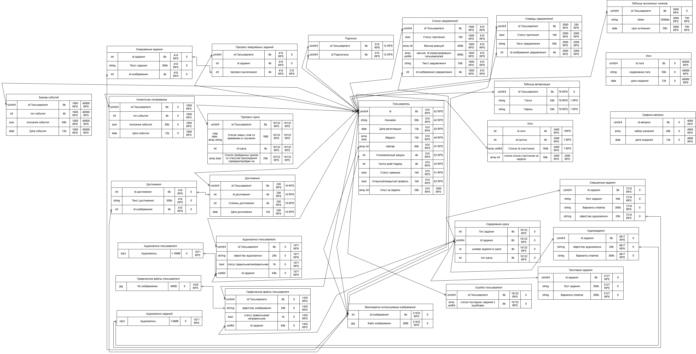
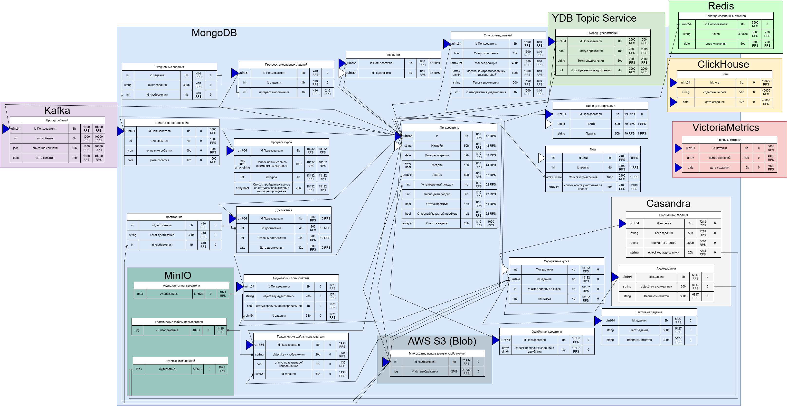

# Duolingo

## Содержание

1. [Тема и целевая аудитория](#1-тема-и-целевая-аудитория)
2. [Расчет нагрузки](#2-расчет-нагрузки)
3. [Глобальная балансировка нагрузки](#3-глобальная-балансировка-нагрузки)
4. [Локальная балансировка нагрузки](#4-локальная-балансировка-нагрузки)
5. [Логическая схема БД](#5-логическая-схема-бд)
6. [Физическая схема БД](#6-физическая-схема-бд)
7. [Алгоритмы](#7-алгоритмы)
8. [Технологии](#8-технологии)
9. [Обеспечение надёжности](#9-обеспечение-надёжности)
10. [Схема проекта](#10-схема-проекта)
11. [Список серверов](#11-список-серверов)
12. [Список источников](#список-источников)

## 1. Тема и целевая аудитория

Duolingo - сервис для изучения иностранных языков.

Ключевой функционал сервиса - предоставление интерактивных уроков в виде уровней, наличие распознавания речи и рукописного ввода.\
Ключевые продуктовые решения - интенсивное напоминание клиенту о занятиях (уведомления), система лиг, друзей, соперничество, ежедневные и ежемесячные квесты. 
Все это помогает справится с самой большой проблемой образовательных проектов - нерегулярным посещением, малым прогрессом и большим процентом уходов клиентов из-за этого.

### **MVP**

1. Регистрация, авторизация
2. Локализация на множество языков (вариативность изучения большого числа языков на разных родных языках)
3. Прохождение курса иностранного языка\
  Уровни подстраивающиеся под клиента (может ли пользователь слушать или говорить, совершал ли он ошибки)
   * Аудирование - клиент слушает аудиозаписи с возможностью видеть текст и отвечает на вопросы по тексту.
   * Правописание - клиент рисует на экране символы алфавита изучаемого языка и после каждого движения нейросеть корректирует пользователя.
   * Изучение алфавита - тестирование на составление простейших слов, слогов, тренировка восприятия на слух алфавита изучаемого языка.
   * Постановка речи - клиент записывает свой голос читая или составляя фразу и нейронка проверяет корректность произношения выделяя неправильно произнесенные слова.
4. Система ежедневных и ежемесячных заданий и уведомлений
5. Система друзей и подписчиков - возможность комментирования и командного взаимодействия

### Фичи

1. Система лиг - соревнования с группой людей по количеству набранных за неделю очков, получаемых за прохождение уроков
2. Система достижений
3. Распознавание речи в уроках для тренировки произношения
4. Распознование рукописного ввода для уроков изучения алфавитов

### **Целевая аудитория**

Посещений за месяц: 97.6M 28% или 32.4M из США\
Посещений в день 31.4M\
Неэффективных пользователей : 32.38%\
Среднее количество посещенных страниц за сеанс: 6.13\
Средняя продолжительность посещения: 00:08:51

Из вышеперечисленного следует, что целевая аудитория Duolingo люди в возрасте от 18-54, хотя я думаю что и младше тоже надо учитывать, потому что есть программы внедрения в школы.
 Продукт подходит и актуален для любых стран хотя больше всего используется в северной Америке.

## 2. Расчет нагрузки

### **Продуктовые метрики**

* Посещений за месяц: 97.6M
* Посещений в день 31.4M

Duolingo хранит большой объем данных, но они универсальны для всех пользователей - множество языков, слов, иероглифов, изображений алфавитных символов для их распознавания,
 аудиозаписи очень большого количества фраз и тд. Уникальными для каждого пользователя являются такие данные как: регистрационные данные пользователя, данные профиля,
  собираемый из примитивов аватары пользователей (что позволяет не хранить картинки, а собирать их по идентификаторам (или хранить в кеше недолгое время пока пользователь активен)),
   данные о достижениях пользователя, о подписках, подписчиках, состояние прохождения пользователем квестов и тд. однако это текстовая или числовая информация очень малого объема,
    которая учитываться не будет. Также приложение хранит аудиозаписи голоса пользователя и изображения его рукописного ввода, это медиаконтент занимающий значительных объем памяти. \
В среднем пользователь проводит на сайте 9мин, на сайте сказано что на прохождение одного урока требуется около 7мин. В одном уроке примерно 3 задания на произношение,
 которые в среднем требуют 20-30сек аудиозаписи, также учтем, что пользователи ошибаются и возьмем что в среднем на 1 задание требуется 2 попытки. Получаем 1 урок -> 3 задания на аудирование -> 6 попыток -> 3мин аудиозаписи в день на пользователя.
  Так как пользователь обучается языку и не привык на нем говорить, для распознавания его речи понадобится высокое качество аудиозаписи - возьмем 320kbps, для 3мин это будет 7,03 MB. \
Также оставшиеся 2 минуты из 9 минут посещения считаем изучением правописания алфавитных символов, это примерно 0.5 урока на изучение правописания,
 в 1 уроке примерно 8 заданий на написание, изображение может быть не очень высокого качества так как изображается только 1 символ, однако слишком маленьким быть не может так как есть сложные иероглифы,
  на сайте при разных размерах экрана изображение варировалось от 300х300 до 400х400.

Для перестраховки возьмем 400 на 400 пикселей, изображение ЧБ соответственно 160000 пикселей будет весить 320000бит это 40Kb каждое,
однако корректировка пользователя происходит после каждой линии соответственно с учетом иероглифов состоящих из множества линий возьмем среднее значение в 6 линий на символ,
 значит 6 картинок на одно задание это уже 240Kb. 0.5 урока -> 4 задания на рисование -> 960Kb на пользователя в день.
Duolingo не хранит неправильные попытки наверняка и отсеивает 40% (предположение) данных, а из остального получаем прирос в месяц.
Согласно найденным данным Duolingo был запущен 2012, в 2017 было уже 30MAU, в 2021 40MAU, в 2023 83MAU, в 2024 113MAU, построим примерный график.

Будем считать что DAU=0.25MAU так как сейчас почти треть, но раньше было меньше наверняка. Посчитаем площадь под кривой - 497M, разделим на 12 лет получим 41,41M MAU среднюю. 10,3M DAU среднее из расчета четверть MAU.
Далее у нас есть 500М пользователей в приложения на андроид что составляет 80% от всех мобильных пользователей значит всего их 625M, что в свою очередь 80% всех пользователей, значит всего 781M,
 разделим объем на данный момент на количество пользователей на данный момент и получим средний размер хранилища в штуках и GB.

| Тип данных                    | Средний размер | Единиц на пользователя в день | Количество на данный момент | Вес на данный момент | Прирост в день|Прирост в месяц|Средний размер хранилища пользователя (Шт)|Средний размер хранилища пользователя (GB)|
| -----------------------       | -------------- | ---------------------- | --------------------------- | -------------------- | --------------- | --------------- |--------------- | --------------- |
| Аудиозапись голоса            | 1,16MB(1мин)   |  3   |   1,35*10^11  |    150000TB |  +104TB   |+1870TB   | 172,86   | 0,2   |
| Изображения рукописного ввода | 40Kb           |   24 | 1,08*10^12    |  40000TB   |    +28TB |+504TB   | 1382,84   | 0,05   |
| Суммарно | -           |   - | 1,21*10^12    |  190000TB   |    +132TB |+2374TB   |  1555,7 |  0,25 |

> **Примечание:**
>
> * Прирост в день на основе актуальных данных, общее количество на основе усредненных.
> * Количество данных из расчета, что все данные всех пользователей хранятся как минимум для улучшения используемых в приложении нейросетей.

| Действие пользователя              | Среднее количество в день у 1 пользователя |
| ---------------------------------- | ------------------------- |
| Задание на произношение                       |    3 |
| Задание на правописание                       |   4  |
| Задание с озвучкой                       |  19   |
| Задание аудирование                       |  0.3   |

> **Примечание:**
>
> * Задание на произношение - пользователь отправляет на сервер аудиозапись примерно 1,16MB.
> * Задание на правописание - пользователь отправляет на сервер в среднем 6 картинок которые суммарно весят примерно 240Kb.
> * Задание с озвучкой - пользователь получает с сервера 2 аудиозаписи примерно 1,4MB в обычном темпе и с более четким и медленным произношением (записи 2, но они меньше чем пользовательские).
> * Задание аудирование - пользователь получает с сервера примерно 6 аудиозаписей примерно 5,2MB суммарно.

### **Технические метрики**

График посещения выглядит примерно так, добавим к этому малое размытие аудитории по часовым поясам и активное напоминание пользователям в определнные часы - соответственно пиковое потребление от среднего отличается в 4 раза.

DAU = 31M, каждый пользователь в течении 9 мин выполняет 0.7 уровня и 0.3 аудирования (выполняет либо либо, но аудирование реже встречается)  и 0.5 задания на правописания.
Получается общее количество запросов на задания: с произношением - 93M, с правописанием - 124M, с озвучкой - 589M, аудирование - 9,3M.
Из этих данных рассчитаем Средний RPS, равномерно распределив запросы в течении дня, а потом посчитаем пиковый RPS из предположения что распределение согласно картинке выше и Максимальный RPS=4*RPS средний.
Для того чтобы посчитать пиковое потребление в секунду домножим пиковый RPS на вес тела запроса и переведем в Гбит/с. Далее конвертируем его в суточный и переводим в Гбайт/сутки.
При регистрации указываются только почта и пароль которые практически ничего не весят и ими можно пренебречь даже при большом RPS.
Предположим повторную авторизацию раз в месяц и из этого её рассчитаем. На главную страницу пользователь попадает каждый раз когда заходит на сайт так, что он будет больше DAO (1.5 раза так как ещё при переключении между курсами и после лидерборда).
Регистрацию рассчитаем из предположения о приросте как за последний год (+22М/360дней/24часа/60сек).

| Действие пользователя              | Средний RPS | Пиковый RPS |Пиковое потребление в сутки Гбит/с|Суммарный суточный Гбайт/сутки|
| ---------------------------------- | ------------|------------ |------------ |------------ |
| Регистрация                       |    42 |    167 |    0 |    0 |
| Авторизация                       |    37 |    149 |    0 |    0 |
| Главная страница                       |    363 |    1453 |    0 |    0 |
| Задание на произношение                       |    1076 |    4304 |    39 |    421254 |
| Задание на правописание                       |   1435  |    5740 |    2,62 |    28377 |
| Задание с озвучкой                       |  6817   |    27268 |    74,6 |    805258 |
| Задание аудирование                       |  107   |    428 |    4,3 |    46946 |
| Суммарно                       |  -   |   -  |    120,52 |   1301838  |

## 3. Глобальная балансировка нагрузки

### Функциональное разбиение по доменам

Отсутствует - вся функциональность сайта находится по одному домену www.duolingo.com

### Обоснования расположения ДЦ (влияние на продуктовые метрики)

Требуется расположить ДЦ во всех регионах самого активного пользования так как это позволит уменьшить задержку, которая влияет на продуктовые метрики и user experience.
Во время прохождения уроков предзаписанное аудио можно выгружать заранее и параллельно прохождению урока, но вот пользовательские записи голоса придется отправлять и обрабатывать в онлайн формате,
так как пользователь не захочет долго ждать их обработки, перед тем как перейти к следующему заданию или исправлению этого. Для оптимального расположения еще раз посмотрим на карту распространения пользователей.
Сервер средней мощности (8 vCPU, 32GB RAM) может выдавать примерно 100-500 Мбит/с возьмем в среднем 300 Мбит/с. Пиковое потребление в сутки  в прошлом разделе вышло 120,52 Гбит/с.
Значит нам понадобится 120,52*1024/300=412 таких серверов, возьмем запас х2 для надежности это получится 800 серверов. Расположим их по 6 ДЦ, но не равномерно а в соответствии с количеством пользователей.

* 2 ДЦ в США (в Альбукерке и Индианаполисе) он будет покрывать 28.3% трафика приходящего США,
соответственно на него будет приходиться 28.3% серверов, 227 серверов по 113 серверов на каждый ДЦ в США.
* ДЦ в Канаде (в Эдмонтоне ближе к США да и плотность населения в Канаде ближе к северной границе США выше) он будет покрывать 3.6% трафика приходящего из Канады и поддерживать сервера США в случае их перегруженности,
соответственно на него будет приходиться 3.6% серверов = 29 серверов.
* ДЦ в Бразилии (в столице там будет легче обеспечить необходимые для строительства ДЦ условия) он будет покрывать 6.5% трафика приходящего из Бразилии и поддерживать сервера США в случае их перегруженности,
соответственно на него будет приходиться 6.5% серверов = 52 сервера.
* ДЦ в Великобритании (в Ньюкасле) он будет покрывать половину оставшихся 52.5% трафика приходящего из остальной мир и 5% из самой Великобритании,
соответственно на него будет приходиться 29,05% серверов = 233 сервера.
* ДЦ в Германии (в Дрездене) он будет покрывать половину оставшихся 52.5 % трафика приходящего из остальной мир и 3.9% из самой Германии,
соответственно на него будет приходиться 30,15% серверов = 242 сервера.

### Расчет распределение запросов из секции "Расчет нагрузки" по типам запросов по дата центрам

Запросы на регистрацию, авторизацию и получение главной страницы не несут много данных и не обязательно должны быть мгновенными, поэтому их можно посылать в любой ДЦ, поэтому будем выбрать наименее загруженный. Аудирование и задания с озвучкой несут много аудиоданных, однако могут загружаться пока пользователь выполняет предыдущее задание, так как порядок заданий строгий, поэтому задержка здесь тоже не важна и мы будем присылать из на наименее загруженный сервер.
А вот в заданиях на произношение и правописание необходимо как можно быстрее вернуть пользователю результат анализа его данных, поэтому следует отправлять эти запросы в ДЦ с минимальной задержкой ответа.

| Действие пользователя              | Распределение по ДЦ |
| ---------------------------------- | ------------|
| Регистрация                       |    Наименее загруженный |
| Авторизация                       |    Наименее загруженный |
| Главная страница                       |    Наименее загруженный |
| Задание на произношение                       | С минимальной задержкой |
| Задание на правописание                       | С минимальной задержкой |
| Задание с озвучкой                       |  Наименее загруженный   |
| Задание аудирование                       |  Наименее загруженный   |

### Схема DNS балансировки (при наличии)

DNS балансировка будет производиться между континентами, так как IP адреса довольно хорошо локализованы меду ними. Выберем тип Latency-based DNS балансировки для этого, так как Round-Robin подход нас не устраивает из-за того, что задержка будет приличная, так как сервера на разных полушариях. Geo-based тоже в принципе подходит, но не учитывает загруженность серверов и еще не все согласны добавлять свой пусть и анонимизированный IP в запрос для определения геолокации. Latency-based DNS выдает адрес ближайшего к пользователю ДЦ c с минимальным RTT (круговой задержкой).

### Схема Anycast балансировки (при наличии)

Внутри стран DNS балансировка работает хуже роутинга из-за того что крупные компании могут не заморачиваться о задержке между городами поставив общие dns сервера в годах, так как из сеть слишком глобальная, поэтому будем использовать BGP Anycast. Балансировка будет только в Северной Америке и в Европе, так как нужна сложная настройка, автономный номер AS (Необходимо договориться с двумя вышестоящими провайдерами, и получить от них номер автономной системы) и доступ к BGP (протокол динамической маршрутизации). BGP Anycast балансировка позволит минимизировать задержку для пользователей в Северной Америке и уменьшить количество неоптимальных запросов в Европе. Необходимо выбрать разные веса для ДЦ, чтобы запросы от одного пользователя не расщеплялись - решение хеширование одно и тоже TCP IP соединение попадает в один и тот же ДЦ.

### Механизм регулировки трафика между ДЦ (при наличии)

Регулировка трафика также будет происходить в Северной Америке и в Европе, на карте обозначены зоны ответственности серверов, в местах их пересечения пользователи могут быть отнесены как одному серверу так и к другому в зависимости от загруженности.

## 4. Локальная балансировка нагрузки

Будем использовать программную балансировку каскадно - сначала L4, потом L7.
Для начала развернем кластер Kubernetes в каждом нашем ДЦ это позволит нам использовать оркестрацию.
Система оркестрации при создании контейнера вносит экземпляр в реестр после успешного прохождение readiness пробы:  
Readiness check - Иногда приложения временно не могут обслуживать трафик. Например, приложению может потребоваться загрузить большие данные или файлы конфигурации во время запуска или зависеть от внешних служб после запуска. В таких случаях вы не хотите завершать работу приложения, но и не хотите отправлять ему запросы. Kubernetes предоставляет проверки готовности для обнаружения и смягчения таких ситуаций.  
Liveness check - Проверка работоспособности серверов с помощью специального cgi-bin/ping (максимально похожий на обычный запросы, но не создающий нагрузки). Ping не позволяет проверить запущен ли нужный софт на машине.
Установка соединения на порт, проверяет, что сревис слушает порт, но не проверяет его способность отвечать.
Простенький head или get запрос тоже не подойдет, так как не проверит работоспособность взаимодейтсвия сервиса с бд например. Поэтому будем использовать cgi-bin/ping который позволит все это проверить.
Также использование Kubernetes позволит нам сделать масштабирование через auto-scaling - при этом в пиковые часы развертывается больше мощностей и снижать их когда нагрузка спадает.
С DNS балансировкой внутри ДЦ возникает много проблем с кешированием и появляется высокая нагрузка на сам DNS.

### IP балансировка L4: Virtual Server via IP Tunneling

NAT нам не подходит, так как сам балансировщик станет узким местом из-за того что весь обратный трафик идет через балансировщик.  
В случае Direct Routing сервера должны быть в одной физической сети, да и это не является стандартом индустрии и над ним не ведется активной разработки и залатывания уязвимостей.  
IP Tunneling позволит нам располагать сервера в разных физических сетях и обеспечит высокую производительность, хоть и потребует сложной настройки.  
**Суть метода**:
Балансировщик инкапсулирует запрос в IP-туннель и отправляет его реальному серверу. Реальный сервер извлекает оригинальный пакет и отвечает клиенту напрямую.
Для надежности балансировки используем технологию VRRP/CARP с ней балансеров нужно в 2 раза больше, чем для обеспечения пикового трафика.  
**Суть** - один IP поднят на 2 машинах, но на одной он не анонсируется в сеть, когда один падает второй получает весь трафик анонсируя в сеть что IP теперь принадлежит этому MAC-адрес.

### Layer 7 HTTP Reverse Proxy

Предварительный парсинг оригинального протокола (хоть мы и читаем протокол дважды, за счет высокой производительности С на котором написаны обработчики балансировщиков и меньшей производительности приложений,
написанных на Python и Go это не даст большого прироста времени обработки)
HTTP Reverse Proxy позволит:

* Производить SSL Termination на прокси сервере перед передачей на бекенд
* Кешировать ответы бекенда
* Gzip - сжимать данные перед отправкой
* решит проблему медленных запросов, так как nginx позволяет перехватывать ответы от бекенда и освобождать воркеров, занимаясь передачей данных медленному клиенту самостоятельно.
Также следует сделать авторизацию на nginx - сделать отдельный сервис авторизации и не пускать никакие запросы от неавторизованных пользователей, это даст дополнительную защиту от DDOS атак и позволить проводить авторизацию с существенно большим RPS.
Еще L7 балансировка позволит перенаправлять запросы с упавших серверов на живые (прям те которые обрабатывались в момент падения), тем самым создавая максимально хороший user experience - для пользователя вообще незаметно падение серверов.  
Nginx держит постоянное соединение с бекендом, что сильно экономит ресурсы на запросы установления соединений.  
В качестве алгоритма балансировки выберем list-connections, где мы кидаем запрос на тот сервер у которого меньше всего соединений, так как у нас запросы долгие и тяжелые (обработка медиаконтента клиента), это подойдет лучше чем round-robin.
В качестве таймаута используем метод определения с помощью квантилей, выберем - p90 оптимальный баланс стабильности и скорости.

**Для терминации SSL** выберем алгоритм ECDSA 256-бит, он быстрее (40–60% по сравнению с RSA), создает меньше нагрузка на CPU.
Для оптимального трафика необходимо держать максимальное количество пользовательских сессий в кеше, потому что установка нового handshake очень дорогая и по latency и по CPU.
Есть вариант оптимизировать SSL терминацию путем выдачи всем хостам внутри ДЦ одного и того же IP, и использовать тогда все зависимости от того куда балансировщик распределит запрос пользователя, сессия всегда убдет валидна и не придется заново устанавливать handshake из-за того, что поменялся IP у принимающего запрос хоста.

## 5. Логическая схема БД

### **Таблицы:**

**Пользователь** - содержит информацию о пользователе, может быть разделена на группы пользователей, путем хеширования id пользователей по физически разным БД, что снизит нагрузку.  
**Таблица авторизации** - содержит авторизационные данные пользователя, выделены в отдельную таблицу, так как они запрашиваются только сервисом авторизации и могут быть изолированы.  
**Подписки** - содержит данные о том какой пользователь на какого пользователя подписан.  
**Прогресс курса** - тоже подлежит большой нагрузке, поэтому можно также разделить на части по группам пользователей.  
**Лиги** - содержит информацию о лигах и людях которые в них состоят, так как внутри лиг существуют группы, обновляемые раз в неделю, каждая строка будет представлять группу, список пользователей использовать нормально, так как обновляется он целиком раз в неделю.  
**Достижения** - содержит информацию о достижениях пользователя, нагрузка равна нагрузке на пользователей, но вынесена так как обновляется по частям каждое достижение в отдельности.  
**Ежедневные задания** - информация о состоянии ежедневных заданий пользователей также часто обновляется, поэтому вынесена в отдельную таблицу.  
**Содержание курса** - таблица для объединения заданий в курсы, и для комбинирования курсов на несколько языков.  
**Тестовые задания** - задания содержащие только текст, разделены для оптимизации памяти и нагрузки.  
**Аудиозаписи пользователя** - аудиозаписи, которые присылал пользователь в качестве ответов на задания, также высокая нагрузка на запись поэтому вынесена в отдельную таблицу.  
**Графические файлы пользователя** - графические файлы, которые присылал пользователь в качестве ответов на задания, также высокая нагрузка на запись поэтому вынесена в отдельную таблицу.  
**Аудиозадания** - задания содержащие только аудио, разделены для оптимизации памяти и нагрузки.  
**Текстовые задания** - задания содержащие только текст, разделены для оптимизации памяти и нагрузки.  
**Список уведомлений** - список уведомлений пользователя, также часто обновляются поэтому выделено в отдельную таблицу.
**Ошибки пользователя** - содержит последние ошибки пользователя, также часто обновляются поэтому выделено в отдельную таблицу.  
**Многократно используемые изображения** - так как изображения в большинстве своем часто повторяются и состоят из одних элементов, выделена отдельная таблица для хранениях этих примитивов из которых собираются все изображения.  
**Очередь уведомлений** - очередь уведомлений для реализации realtime уведомлений.  
**Графические метрики** - сбор метрик в виде графиков для мониторинга состояния сервиса.  
**Логи** - логирование запросов выделено в отдельную таблицу, так как ее можно отдельно оптимизировать.  

### **Логическая схема:**

В таблицах слева направо столбцы называются соответственно  
Тип поля, название поля, RPS на чтение, RPS на запись

### **Особенности распределения нагрузки по ключам:**

* **Шардирование по пользователям**

Пользователей очень большое количество (500М+) и у них мало взаимодействия друг с другом, поэтому их можно шардировать по id Пользователя, разделив пользователей на группы и закрепив их id за определенным шардом, например с помощью hash-map структуры, таблицы содержащие id Пользователя также будут хранится в тех же шардах и распределяться по ним по такому же механизму - для простого и быстрого доступа.

* **Партиционирование по дате**

Для Логирования часто используют отдельную БД, а также партиционирование по  по месяцам/неделям. Устаревшие логи можно перемещать в более дешевое хранилище, так как их анализируют реже и нагрузка на них меньше.

* **Репликация**

Для повышения отказоустойчивости (альтернативных источников чтения в случае проблем с БД) и повышения скорости чтения + разделения нагрузки на чтение и запись используют реплики. Основной узел Primary отвечает за запись, а чтение масштабируется за счёт Replica-нод (Secondary).

## 6. Физическая схема БД

### Выбор баз данных

**MongoDB** - будем использовать для большинства таблиц, автоматически хорошо масштабируется, Casandra не нужна так как там требуется полная денормализация, а еще в монго легче масштабироавние.  
**YDB Topic Service** - для realtime уведомлений, надежная модель горизонтально масштабирования, в одну шину пишем из другой читаем, лучше чем Kafka переживает шардинг, хранение данных не в трехкратном размере а в 1,5 с той же степенью надежности.  
**Click House** - для логов и метрик в цифровом виде, он позволит хорошо сжимать данные и обрабатывать большие нагрузки.
**Virtoria metrics** - для графиков метрик - более горизонтально масштабируемая система.  
**MinIO** - будем использовать для хранения пользовательских аудиозаписей и рукописных вводов, так как эта БД имеет высокую нагрузку на запись, хорошо масштабируется, поддерживает S3.  
**Cassandra + S3** -  будем использовать для хранения аудиофайлов, которые будем раздавать клиентам, Cassandra имеет низкие задержки на чтение, хорошо масштабируется и дешевле AWS.  
Blob для мелких изображений, выберем **AWS S3**, что обеспечит нам качественные алгоритмы и высокую поддержку, хорошее горизонтальное масштабирование при необходимости.  

### Шардирование

Будем использовать **Primary-Secondary** шардирование, это позволит нам снизить высокую нагрузку на чтение, разделив ее по Secondary репликам.
Будем использовать **Hash-based sharding** на основе ключей - чаще всего **id пользователей**, так как они равномерно распределены по всему диапазону, а также таблицы соответственно хорошо изолированны из-за малого взаимодействия пользователей друг с другом.  
В **mongodb** один mongod может обрабатывать 10K операций в секунду, исходя из этих расчетов и того, что mongodb не умеет выполнять join между шардами, получим 7 шардов.  
В логгировании (таблицы с логами и метриками) будем использовать **партиционирование по дате**.  
В базе данных **VirtoriaMetrics** - vminsert распределяет данные по шардам по хэшу метрики, поэтому:  
Все данные с одинаковыми именем метрики попадают на один шард. Это уменьшает нагрузку на один узел, но важно правильно подобрать количество шардов. (Будем использовать 5 шардов это оптимальное количество для примерно 10-50 млн временных рядов)  
**MinIO** — это объектное хранилище, совместимое с S3 API, которое поддерживает горизонтальное масштабирование за счёт дисков и серверов. Шардирование в MinIO происходит на уровне разбиения данных (erasure coding) и балансировки между узлами (distributed mode).  
Erasure Coding (EC) — ключевая технология MinIO разбивает объекты на фрагменты и распределяет их по дискам. Выберем для отказоустойчивости конфигурацию EC:4+2: 4 фрагмента для данных 2 фрагмента для восстановления. 
В **Casandra** для крупных кластеров используется более 30 узлов, так как у основная нагрузка у нас идет здесь то выберем 35 узлов и соответсвенно 512 vnodes (в Apache Cassandra, который позволяет одному физическому узлу (серверу) отвечать за несколько диапазонов токенов в кластере, а не за один непрерывный диапазон, как в традиционном подходе с ручным распределением токенов). Это позволит проводить автоматическую балансировку, упростить администрирование и улучшить распределение.

### Резервирование

Будем использовать **автоматическое резервирование**, если Primary выходит из строя, один из Secondary становится новым Primary.  
Также будем использовать mongodump / mongorestore, для логического бекапа всей БД в BSON-формате и восстановления данных соответственно.  
Для быстрого восстановления будем использовать mongodump, который делает снапшот всей БД.
Также будем использовать облачные бекапы в S3 через MongoDB Atlas.  

### Мультиплексирование запросов

MongoDB-клиенты используют пулы соединений для повторного использования уже установленных подключений. Это уменьшает накладные расходы на создание новых соединений.  

* При новом запросе клиент не создаёт новое соединение, а использует готовое из пула
* Если соединений не хватает, пул создаёт новые
* Если соединение не используется долгое время, оно может быть закрыто

Также будем использовать Keep-Alive соединения (долгоживущие TCP-соединения) для поддержания обмена файлами с клиентом, для меньшей задержки и более полезной утилизации ресурсов сервера (не будем тратить ресурсы на установление новых соединений).

### **Физическая схема:**

Синие треугольники - ключи шардирования
Белые треугольники - индексы

## 7. Алгоритмы

## 8. Технологии

## 9. Обеспечение надёжности

## 10. Схема проекта

## 11. Список серверов

## Список источников

1. SimilarWeb - https://www.similarweb.com/ru/website/duolingo.com/#overview
2. duolingo.com - https://investors.duolingo.com/news-releases/news-release-details/duolingo-reports-45-revenue-growth-and-record-profitability
3. forbes.ru - https://www.forbes.ru/investicii/502934-kak-prilozenie-dla-izucenia-azykov-duolingo-pokorilo-fondovyj-rynok-v-2023-godu?utm_source=chatgpt.com
4. rbc.ru - https://www.rbc.ru/quote/news/article/60fea8919a79473d54b083fa?utm_source=chatgpt.com
